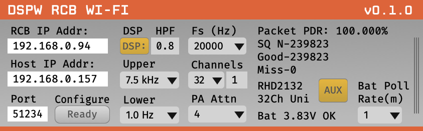

# DSPW RCB Wi-Fi Plugin



For use with DSPW RCB Wi-Fi devices (RCB-W24A-LVDS and RCB-W24B-LVDS).
Setup, and control multiple RCB devices.
Stream up to 32 channels 20ksps data from Intan RHD2123 and RHD2216 headstages.

## Installation

This plugin will soon be available via the Open Ephys GUI's built-in Plugin Installer. Press **ctrl-P** or **⌘P** to open the Plugin Installer, browse to "DSPW RCB Wi-Fi," and click the "Install" button. The RCB Wi-Fi plugin should now be available to use.

## Usage

Instructions for using the DSPW Plugin will be available soon.

## Building from source

First, follow the instructions on [this page](https://open-ephys.github.io/gui-docs/Developer-Guide/Compiling-the-GUI.html) to build the Open Ephys GUI.

Then, clone this repository into a directory at the same level as the `plugin-GUI`, and update submodules e.g.:

```
cd OEPlugins
git clone https://github.com/open-ephys-plugins/RCBWiFi.git
cd RCB-WiFi
git submodule update --init
``` 

```
Code
├── plugin-GUI
│   ├── Build
│   ├── Source
│   └── ...
├── OEPlugins
│   └── XDAQ-OE
│       ├── Build
│       ├── Source
│       └── ...
```

### Windows

**Requirements:** [Visual Studio](https://visualstudio.microsoft.com/) and [CMake](https://cmake.org/install/)

From the `Build` directory, enter:

```bash
cmake -G "Visual Studio 17 2022" -A x64 ..
```

Next, launch Visual Studio and open the `OE_PLUGIN_RCBWiFi.sln` file that was just created. Select the appropriate configuration (Debug/Release) and build the solution.

Selecting the `INSTALL` project and manually building it will copy the `.dll` and any other required files into the GUI's `plugins` directory. The next time you launch the GUI from Visual Studio, the XDAQ plugin should be available.


### Linux

**Requirements:** [CMake](https://cmake.org/install/)

From the `Build` directory, enter:

```bash
cmake -G "Unix Makefiles" ..
cd Debug
make -j
make install
```

This will build the plugin and copy the `.so` file into the GUI's `plugins` directory. The next time you launch the compiled version of the GUI, the XDAQ plugin should be available.


### macOS

**Requirements:** [Xcode](https://developer.apple.com/xcode/) and [CMake](https://cmake.org/install/)

From the `Build` directory, enter:

```bash
cmake -G "Xcode" ..
```

Next, launch Xcode and open the `OE_PLUGIN_RCBWiFi.xcodeproj` file that now lives in the “Build” directory.

Running the `ALL_BUILD` scheme will compile the plugin; running the `INSTALL` scheme will install the `.bundle` file to `/Users/<username>/Library/Application Support/open-ephys/plugins-api8`. The XDAQ plugin should be available the next time you launch the GUI from Xcode.


## Attribution

This plugin was developed by Robert Paugh at DSPW, leveraging code from Rhythm Plugins, Ephys Socket by Josh Siegle, Aarón Cuevas López and Jon Newman.
